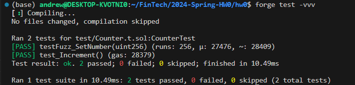
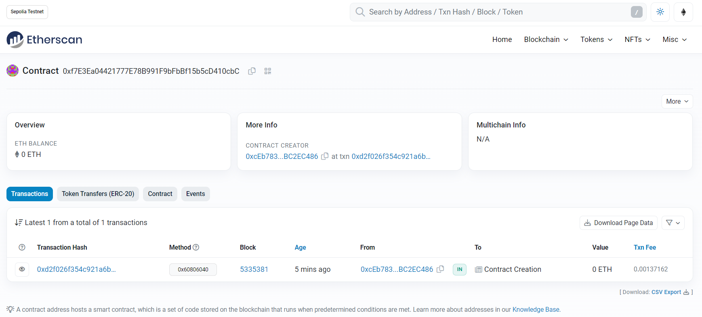

# 2024-Spring-HW0

All the detailed specified in Homework 0 documentation.

## Wallet Address
Please provide your MetaMask wallet address:

0xcEb78331824bd951023c88956671Bb51BC2EC486

## Local Testing
Please provide a screenshot of the `forge test -vvv` command running in your local environment.

## Contract Address
Please provide the contract address that you deployed on the Sepolia network.

0xf7E3Ea04421777E78B991F9bFbBf15b5cD410cbC

## Sepolia Etherscan
Paste the contract address into the Sepolia Etherscan and share the screenshot.

